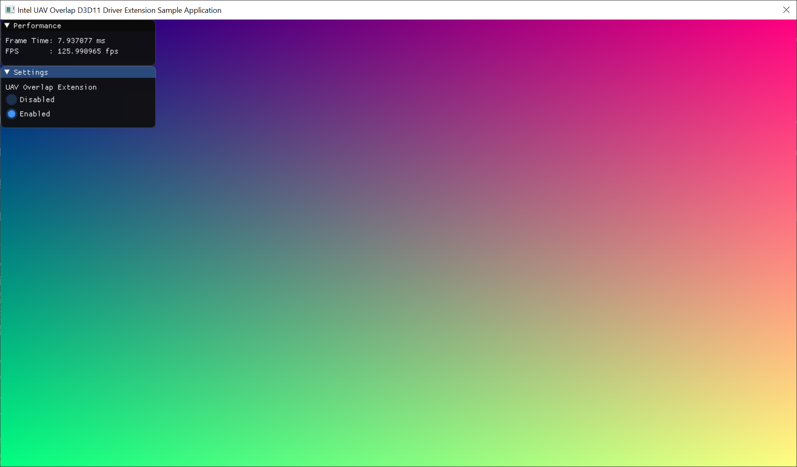

## Summary
Sample Code for using the UAV Overlap Intel Driver Extension

## Using the Intel D3D Extensions Framework (Pre-Alpha)

To use the extensions supported by Intel's D3D Extensions Framework, you must include igdext.h in your project.
Then, you may either statically link igdext64.lib with your project, or dynamically link against igdext64.dll (included with every Intel graphics driver).

### Load the extension library into your process
``` 
HRESULT INTC_LoadExtensionsLibrary(bool useCurrentProcessDir = false);
```

Loads the Extension Framework .dll into the currently active process. This step must be done first, as it fills in the rest of the entrypoints found in igdext.h.

### (Optional) Get the list of supported versions of the Extensions Framework
``` 
HRESULT INTC_D3D11_GetSupportedVersions(
    ID3D11Device*          pDevice,
    INTCExtensionVersion* pSupportedExtVersions,
    uint32_t*              pSupportedExtVersionsCount); 
```

`INTCExtensionVersion` is a struct with 3 integer components: { HWFeatureLevel, APIVersion, Revision }.
- HWFeatureLevel - Nearly every extension requires some specific hardware support, so it is important to check the HWFeatureLevel to determine if your GPU has the required feature level for the extension(s) you want to use.. 
- APIVersion - Software version of the Extensions Framework itself. It gets incremented over time as new extensions are added to the Framework.
- Revision - Reserved for bugfixes. 

Production extensions are guaranteed to be backwards-compatible, but experimental extensions make no such guarantee.

This step is optional, but useful for confirming that your platform (combo of GPU and driver) will support an extension before you attempt to use it. 

Note: There is a matching entrypoint for D3D12 extensions. 

### Create an ExtensionContext object
```
HRESULT INTC_D3D11_CreateDeviceExtensionContext(
    ID3D11Device*          pDevice,
    INTCExtensionContext** ppExtensionContext,
    INTCExtensionInfo*     pExtensionInfo,
    INTCExtensionAppInfo*  pExtensionAppInfo);
```

Prior to using this function, you need to declare an object of type `INTCExtensionContext*`, and pass in its address. The memory for this object is allocated by the Extensions Framework, so the application will later need to call `INTC_DestroyDeviceExtensionContext(...)` (see below). 

The `INTCExtensionInfo` struct contains primarily output members, but the one required input is an `INTCExtensionVersion RequestedExtensionVersion`, indicating the version of the Extensions Framework you want to initialize. 

The `INTCExtensionAppInfo` struct contains completely optional input members. 

If this function returns successfully, the `INTCExtensionContext` object will have been created, and it will be used as an input parameter to every other extension entrypoint. 

Note: There is a matching entrypoint for D3D12 extensions. 

### Destroy the ExtensionContext object
```
HRESULT INTC_DestroyDeviceExtensionContext(INTCExtensionContext** ppExtensionContext);
```

As stated above, the Extensions Framework is responsible for allocating and deallocating the memory for the `INTCExtensionContext` object. This function is required to properly destroy the context and free its memory. 

### Unload the Extensions Library
```
void INTC_UnloadExtensionsLibrary();
```

Manually unload the Extensions Framework .dll at shutdown or if initialization fails.

## Using UAV Overlap

In D3D11, draws and dispatches that write to the same UAV are serialized in order to prevent race conditions. 
However, this potentially incurs a heavy performance cost. 
If an application developer knows that a set of draws/dispatches will not cause a race condition 
(for example, because in their algorithm, each draw/dispatch is guaranteed to access a unique part of the UAV), 
then the UAV Overlap extension can be used to instruct the driver not to serialize them. 

### Begin UAV Overlap
```
HRESULT INTC_D3D11_BeginUAVOverlap(INTCExtensionContext* pExtensionContext);
```

Marks the beginning point for disabling GPU synchronization between consecutive draws and dispatches that share UAV resources.

### End UAV Overlap
```
HRESULT INTC_D3D11_EndUAVOverlap(INTCExtensionContext* pExtensionContext);
```

Marks the end point for disabling GPU synchronization between consecutive draws and dispatches that share UAV resources.


## Code Sample

In this code sample, we simulate an algorithm that an application developer might write where a set of dispatches would be guaranteed to access unique portions of the same UAV. 

To make the performance cost of serializing these dispatches abundantly clear, this sample runs 3600 dispatches back-to-back, each of which writes to a unique 16x16 block of pixels in a 2D texture, which is then rendered to the screen as a 1280x720 render target. 



The key piece of code to learn from is this section, where we wrap our dispatches between calls to `INTC_D3D11_BeginUAVOverlap` and `INTC_D3D11_EndUAVOverlap`: 

```
// Disable UAV syncs until a call to INTC_D3D11_EndUAVOverlap() is encountered
INTC_D3D11_BeginUAVOverlap(mINTCExtensionContext);

...

for (uint32_t x = 0; x < numDispatchesX; x++)
{
    for (uint32_t y = 0; y < numDispatchesY; y++)
    {
        // Update the sample constant buffer with the current groupID (x,y)
        ...
        mImmediateContext->Dispatch(1, 1, 1);
    }
}

// Re-enable UAV syncs
INTC_D3D11_EndUAVOverlap(mINTCExtensionContext);
...
```

We use enough 1x1x1 Dispatches to run 1 thread per pixel in our Texture2D that we bind as a UAV. 
Each dispatch kicks off one 16x16x1 thread group, and receives some unique constant data, effectively representing a GroupID over the image. 

In the compute shader we reconstruct a DipatchThreadID using that constant data and the GroupThreadID, and write to the UAV at that location. 
Thus, we guarantee that each write to the UAV is going to touch a unique pixel, and overlapping writes should be perfectly safe. 

```
[numthreads(16, 16, 1)]
void CS(uint3 mGroupThreadID : SV_GroupThreadID)
{
    // Compute screen coordinates for the current thread
    uint xcoord = dispatchX * 16 + mGroupThreadID.x;
    uint ycoord = dispatchY * 16 + mGroupThreadID.y;
    uint2 coord = uint2(xcoord, ycoord);

    // Write out a color to the bound UAV at this thread's screen coordinate
    gOutput[coord] = float4((float)xcoord / windowWidth, (float)ycoord / windowHeight, 0.5, 1.0);
}
```
